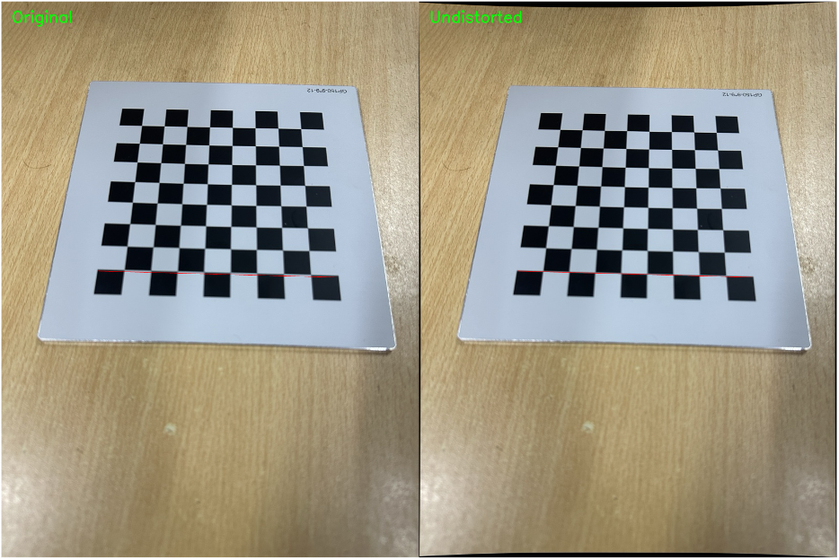
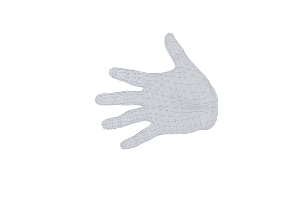
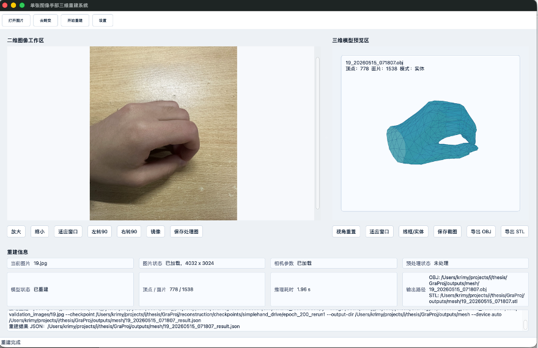

# Single Image Hand Reconstruction

基于单张图像的手部三维模型重建系统。本项目是一个本科毕业设计程序工程，围绕 Qt 桌面应用、相机标定与去畸变预处理、simpleHand 单张图像三维手部重建、OBJ/STL 导出和三维模型预览构建完整演示流程。

> 说明：本仓库主要保存可公开的程序源码、配置示例、标定样例和轻量资源。simpleHand 预训练 checkpoint 文件体积较大，未直接提交到 GitHub。

## Screenshots







## Features

- Qt Widgets 桌面应用界面，支持图片打开、缩放、旋转、镜像和保存。
- 使用 `QProcess` 调用 Python 脚本，连接 C++ 应用层和算法推理层。
- 相机标定预处理模块，支持棋盘格标定、相机参数保存和单张/批量图像去畸变。
- 接入 simpleHand/MANO 预训练模型，完成单张手部图像的三维网格重建推理。
- 输出 OBJ、STL 和 JSON 结果文件。
- 内置轻量三维模型预览，支持旋转、平移、缩放、线框/实体显示切换。
- 配置文件集中管理 Python 解释器、脚本路径、相机参数和输出目录。

## Project Structure

```text
.
├── app/                         # Qt Widgets desktop application
│   ├── CMakeLists.txt
│   └── src/
├── preprocessing/
│   └── camera_calibration/       # Camera calibration and undistortion scripts
├── reconstruction/               # simpleHand reconstruction entry and vendor code
│   ├── checkpoints/              # Checkpoint placeholder and download notes
│   └── simplehand_vendor/
├── resources/
│   └── config/                   # Application config template
├── outputs/                      # Runtime output placeholders
├── scripts/                      # Helper scripts
└── CMakeLists.txt
```

## Requirements

### C++ / Qt

- CMake
- C++17 compiler
- Qt 6 Widgets
- macOS has been used for development and verification

### Python

Recommended packages:

- `torch`
- `opencv-python`
- `numpy`
- `timm==0.9.12`
- `hiera-transformer==0.1.2`
- `trimesh`

The original development environment used:

```bash
/Users/krimy/miniconda3/envs/pytorch/bin/python
```

You can change the Python interpreter path in `resources/config/app_config.example.json` or in the application's settings dialog.

## Build the Qt Application

From the project root:

```bash
/opt/homebrew/bin/cmake -S . -B build -DCMAKE_PREFIX_PATH=/opt/homebrew
/opt/homebrew/bin/cmake --build build --target HandReconstruction -j4
./build/app/HandReconstruction
```

On Windows or Linux, replace the Qt/CMake paths with paths from your local Qt installation.

## Camera Calibration and Undistortion

Run camera calibration:

```bash
/Users/krimy/miniconda3/envs/pytorch/bin/python preprocessing/camera_calibration/calibrate.py
```

Generated files:

```text
preprocessing/camera_calibration/outputs/result.npz
preprocessing/camera_calibration/outputs/camera_params.json
```

Run batch undistortion:

```bash
/Users/krimy/miniconda3/envs/pytorch/bin/python preprocessing/camera_calibration/undistort.py
```

Single-image undistortion example:

```bash
/Users/krimy/miniconda3/envs/pytorch/bin/python preprocessing/camera_calibration/undistort.py \
  --calibration preprocessing/camera_calibration/outputs/camera_params.json \
  --input-file path/to/input.jpg \
  --output-file outputs/images/input_undistorted.jpg
```

## Hand Mesh Reconstruction

Download the simpleHand checkpoint according to `reconstruction/checkpoints/README.md`, then place it under:

```text
reconstruction/checkpoints/simplehand_drive/
```

Example command:

```bash
/Users/krimy/miniconda3/envs/pytorch/bin/python reconstruction/simplehand_reconstruct.py \
  --image preprocessing/camera_calibration/data/validation_images/19.jpg \
  --checkpoint reconstruction/checkpoints/simplehand_drive/epoch_200_rerun1 \
  --output-dir outputs/mesh \
  --device auto
```

The script writes:

```text
outputs/mesh/
├── *_result.json
├── *.obj
└── *.stl
```

The JSON result contains fields such as `success`, `input_image`, `obj_path`, `stl_path`, `vertices_count`, `faces_count`, `device` and `inference_time_sec`. The Qt application reads this result file after the Python process exits and refreshes the UI state.

## Configuration

The application reads the config template from:

```text
resources/config/app_config.example.json
```

Important fields include:

- Python interpreter path
- camera parameter file path
- undistortion script path
- reconstruction script path
- checkpoint path
- image and mesh output directories

For another machine, update these paths before running the full pipeline.

## Notes and Limitations

- The current reconstruction module uses a pre-trained simpleHand/MANO model for inference. It does not train the model from scratch.
- Input images should preferably contain a clearly visible single hand region. Hand detection and automatic bounding-box cropping are not integrated yet.
- The built-in model viewer is a lightweight preview component. It is suitable for demonstration and result inspection, but it is not a high-performance OpenGL shader renderer.
- Large checkpoint files are intentionally excluded from Git. Keep them locally or distribute them through an external model release channel.
- MANO-related assets are included only for this project workflow. Before publishing or redistributing broadly, check the corresponding upstream license requirements.

## Repository Status

This repository contains the program part of the graduation project, including the desktop application, preprocessing scripts, reconstruction scripts, sample calibration data and runtime output placeholders. Thesis documents, local build products, generated meshes/images and large model weights are excluded by `.gitignore`.

